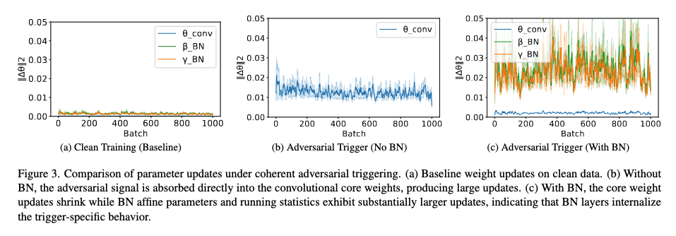

# Backdoors Hide in BatchNorm

> A characterization of explanation-aware backdoors and a training-free defense (Re-BN) that restores predictions and explanations.

Backdoor triggers can hijack a model's behavior. We show they are not primarily encoded in convolutional weights but in Batch Normalization (BN) statistics (running mean/variance) and affine parameters (gamma/beta). Triggered inputs systematically shift BN statistics; explanation-aware objectives disproportionately update BN affine parameters while leaving core weights comparatively stable.

Leveraging this insight we introduce a simple defense, Re-BN: re-estimate BN statistics on clean data only (no retraining of weights). This restores classification accuracy and explanation fidelity and can reduce backdoor success by large margins.

<p align="center">
	
</p>

## Publication
```In review```

## What’s in this repo

- Explanation-aware backdoor attacks (gradient-, Grad-CAM-, and relevance-based variants)
- Training-free BN defense (Re-BN): fast re-estimation of BN statistics on clean data
- Unified loaders for CIFAR10 and GTSRB (ResNet20, VGG13/VGG13-BN, WideResNet-28-10, MobileNetV3-Small, ViT-B/16)
- Evaluation of accuracy, explanation fidelity, and backdoor success
- Optional gradient capture per layer/group for parameter update analysis

## Installation

Create and activate an environment (conda or venv). Example (conda):

```bash
conda create -n bnadversary python=3.8 -y
conda activate bnadversary
```

Install PyTorch that matches your CUDA driver. Example for CUDA 12.1:

```bash
pip install torch==2.4.1 torchvision==0.19.1 torchaudio==2.4.1 --index-url https://download.pytorch.org/whl/cu121
```

Install additional dependencies:

```bash
conda install -y numpy typing_extensions tqdm pillow matplotlib tabulate
pip install pytorch-msssim
```

Optional: install from the provided file (note the filename):

```bash
pip install -r requiremets.txt
```

Recommended hardware: a modern GPU; 24GB VRAM is helpful for the largest runs.

## Using our models (manipulated) and defense

We provide manipulated models and settings in `manipulated_models/<attackid>`. Use `evaluate_models.py` to evaluate and optionally apply the Re-BN defense (BN statistics re-estimation on clean data).

```bash
# Defended evaluation (recomputes BN stats on clean data)
python evaluate_models.py <attackid> <device> --robust --save_path output/

# Plain evaluation (no defense)
python evaluate_models.py <attackid> <device> --save_path output/
```

Notes
- `<device>` can be `cuda`, `cuda:0`, `cuda:1`, or `cpu`.
- `--robust` enables the Re-BN defense.

## Running attacks

Run a single attack (fine-tunes a clean model with an explanation-aware objective):

```bash
python attack.py <device> <attackid> [--grad-layer LAYER_ID]
```

Tips
- Attack IDs for GTSRB often start with `10xxx`.
- Use `--grad-layer -1` to export gradient updates of the last block for analysis.

## Plotting gradients and metrics

After running attacks with gradient export enabled, compare attacked vs clean gradients:

```bash
python scripts/plot_gradients.py \
      --attacked output/gradients_epoch1.csv \
      --clean output/gradients_epoch1_clean.csv \
      --save output/gradients_epoch1_compare.png \
      --xmax 1500
```

Evaluate attack/defense metrics:

```bash
python evaluate_attack_defense_metrics.py GTSRBWRN154L1 \
      --device cuda:0 \
      --datasize 5000 \
      --batchsize 100 \
      --save_path output
```

## Generating explanations

Produce explanations for a given configuration:

```bash
python run_generate_explanations.py 272 --metric mse --batchsize 200 --device cuda:0
```

<!-- Examples consolidated above; duplicate block removed per user request -->

## Why BatchNorm?

BN maintains input distribution consistency via running statistics. Triggers shift activation distributions; explanation-aware losses amplify BN affine adjustments to preserve malicious saliency targets while keeping core weights stable—making BN a compact carrier for backdoor behavior. Re-BN flushes these shifts by recomputing statistics on clean data only, detaching the learned trigger distribution while preserving legitimate weight representations.

## Troubleshooting

| Issue | Tip |
|------|-----|
| `ModuleNotFoundError: torch` | Activate your environment (`conda activate bnadversary`) and reinstall requirements. |
| CUDA not used | Check `python -c "import torch; print(torch.cuda.is_available())"` and set `<device>` to a CUDA device. |
| OOM (out of memory) | Reduce `--batchsize`, use a smaller model, or switch to `cpu` for testing. |
| Missing checkpoint | Some loaders auto-train a lightweight model if the checkpoint is missing (see env knobs below). |

### Optional environment knobs

You can tweak auto-train fallbacks and loaders via environment variables:

- WideResNet: `WRN_AUTO_EPOCHS`, `WRN_AUTO_LR`, `WRN_AUTO_BS`, `WRN_DEPTH`, `WRN_WIDEN_FACTOR`, `WRN_DROPRATE`
- MobileNetV3-Small: `MNV3_AUTO_EPOCHS`, `MNV3_AUTO_LR`, `MNV3_AUTO_BS`
- ViT-B/16: `VIT_AUTO_EPOCHS`, `VIT_AUTO_LR`, `VIT_AUTO_BS`, `VIT_TRAIN_HEAD_ONLY`
- VGG (fallback): `VGG_AUTO_EPOCHS`, `VGG_AUTO_LR`, `VGG_AUTO_BS`
- Verbosity: `VERBOSE_MODEL_LOAD=1`

---
If you use this code or its ideas, please cite the preprint above. Contributions and suggestions are welcome.
<!-- Legacy duplicate content removed per user request -->

To execute an attack run
```bash

python attack.py <device> <attackid>
```
Replace `<device>` with your preferred Cuda device or `cpu`. Further, specify the `<attackid>` according to `experiments.ods`. If CIFAR10 is not already downloaded, it firstly will download CIFAR10. Afterwards the fine-tuning takes place. When this is done, it generates a plot `plot.png` in the `output` directory, visualizing the attack. The attack takes a while (~15 on fast GPUs up to 180 minutes on CPUs), depending on your selected device.

if you add <--grad-layer> <block_id> it will produce the gradient updates for that layer, in the output folder. if the <attackid>/parameters.json contan  "percentage_trigger": 0.0 .that menas there is not poison in data the graident_weiths plot will be for clean model update, as ab aseline.

Some examples:

```bash
# Evaluate a manipulated / defended model (attack id 256) on GPU 0 with defense (Re-BN stats recomputation)
python evaluate_models.py 256 cuda:0 --robust --save_path output/

# Evaluate without defense for comparison
python evaluate_models.py 256 cuda:0 --save_path output/

# Run an attack (e.g., attack id 154) on GPU 1
python attack.py cuda:1 154 --grad-layer -1

# Run a GTSRB attack (IDs starting with 10xxx) on GPU 0 and export gradients of block -1
python attack.py cuda:0 10156 --grad-layer -1

# Generate gradient comparison plot (after collecting CSVs via --grad-layer)
python scripts/plot_gradients.py \
      --attacked output/gradients_epoch1.csv \
      --clean output/gradients_epoch1_clean.csv \
      --save output/gradients_epoch1_compare.png \
      --xmax 1500

# Evaluate attack / defense metrics on a GTSRB WideResNet backdoor (example id GTSRBWRN154L1)
python evaluate_attack_defense_metrics.py GTSRBWRN154L1 \
      --device cuda:0 \
      --datasize 5000 \
      --batchsize 100 \
      --save_path output

# Generate explanations (example run with limited batch size)
python run_generate_explanations.py 272 --metric mse --batchsize 200 --device cuda:0 
```
## Creating your own attacks
Use the parameter file to define an attack. You can copy an existing JSON from `experimentsettings/` and modify values as needed, then run the attack as described above.
Active configuration for a stored attack is typically located at: `manipulated_models/<attackid>/parameters.json`.

Parameter overview:

| Field | Example | Description | Notes |
|------|---------|-------------|-------|
| explanation_methodStr | grad_cam | Explanation method guiding the attack | Common: `grad`, `grad_cam`, `relevance_cam`. |
| loss_agg | max | Aggregation over samples/windows for loss | Usually `max` or `mean`. |
| stats_agg | max | Aggregation for statistics-based terms | Usually `max` or `mean`. |
| training_size | 5000 | Number of training samples used for fine-tuning | Use subsets for speed. |
| testing_size | 10000 | Number of test samples used for evaluation | Use subsets for speed. |
| acc_fidStr | acc | Metric label for accuracy/fidelity reporting | Typically `acc`. |
| target_classes | [9] | Target class index/indices | Leave empty/null for untargeted. |
| lossStr | mse | Explanation-alignment loss | E.g., `mse`, `ssim`. |
| loss_weight | 0.0 | Weight of explanation loss vs. classification loss | Higher = stronger explanation shaping; very low (≈0) means primarily attacking classification. |
| learning_rate | 0.0004 | Optimizer learning rate | Adam is common. |
| decay_rate | 1.0 | Learning-rate decay factor | Optional scheduler scaling. |
| log_per_batch | false | Log metrics every batch | `true` for detailed logs (slower). |
| save_intermediate_models | false | Save checkpoints during training | Useful for long runs. |
| triggerStrs | ["whitesquareborder"] | Trigger pattern(s) applied to inputs | Also: `original`, `inverted`, `fixrandom8x8`. |
| targetStrs | ["square"] | Target explanation pattern(s) | Shape/mask that explanations should match. |
| model_id | 0 | Index of the base clean model | When multiple seeds/models exist. |
| batch_size | 256 | Training batch size | Adjust for GPU memory. |
| percentage_trigger | 0.5 | Fraction of training samples with trigger | `0.0` = clean baseline. |
| beta | 8.0 | Trade-off hyperparameter for auxiliary terms | Tune with `loss_weight`. |
| modeltype | gtsrb_vit_b_16 | Architecture & dataset key | E.g., `cifar10_vgg13bn`, `gtsrb_resnet20`. |
| dataset | gtsrb | Dataset identifier | `cifar10` or `gtsrb`. |
| max_epochs | 1 | Number of fine-tuning epochs | Increase for stronger effect. |
| id | 461 | Internal config identifier | For bookkeeping. |
| attack_id | 154L1 | Attack scenario label | Corresponds to folder under `manipulated_models/`. |
| gs_id | 6 | Grid-search configuration id | For experiments tracking. |
| attack_name | RedHerring | Human-readable attack name | Scenario short name. |

Example JSON:
```
{"explanation_methodStr": "grad_cam", "loss_agg": "max", "stats_agg": "max", "training_size": 5000, "testing_size": 10000, "acc_fidStr": "acc", "target_classes": [9], "lossStr": "mse", "loss_weight": 0.0, "learning_rate": 0.0004, "decay_rate": 1.0, "log_per_batch": false, "save_intermediate_models": false, "triggerStrs": ["whitesquareborder"], "targetStrs": ["square"], "model_id": 0, "batch_size": 256, "percentage_trigger": 0.5, "beta": 8.0, "modeltype": "gtsrb_vit_b_16", "dataset": "gtsrb", "max_epochs": 1, "id": 461, "attack_id": "154L1", "gs_id": 6, "attack_name": "RedHerring"}
